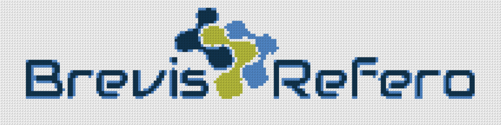
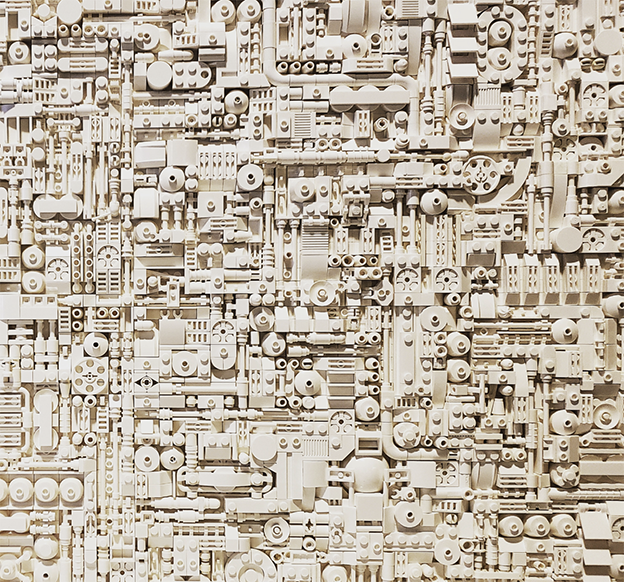

# Greeble Versions of Logos

Greeble versions of all company logos involved with the BrickMMO project. Currently this includes BrickMMO, Humber, BrevisRefero, and LEGO® logos. Logos will be build using four [standard LEGO baseplates](https://www.lego.com/en-ca/product/gray-baseplate-11024). Final size will be 96 x 96 studes. 

## LEGO

 

## BrevisRefero

 

## Humber

 

## BrickMMO

The [BrickMMO Branding](https://github.com/BrickMMO/branding) is still in development. 

## Greeble

Greeble is defined as "small pieces of detailing added to break up the surface of an object and add visual interest" ~ Wikipedia. LEGO greebling is a common building technique used in the LEGO community:

### Types of Greebling

There are two types of greebling in BrickMMO projects:

- Heavy Greebling: Greebling covers every stud. Greebling can be as high as three standards LEGO blocks, but should mostly be around one.
- Light Geebling: Greebling overs most studs. Greebling should mostly be under one standard LEGO block. 

### Rules for Greebling

When working on BrickMMO projects and adding greebling to a project, follow these rules:

1) A stud is covered when any part of a LEGO brick covers any part of a stud.
2) Use as few pieces as possible to cover studs.
3) If you want to add a complex piece to the greeble, use as few pieces as needed to add the piece. 

***

## Repo Resources

- [Brick MeCreator](https://app.brick.me/)
- [BrickMMO Branding](https://github.com/BrickMMO/branding)

