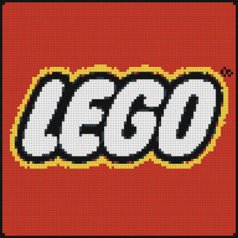

# Greeble Versions of Logos

Greeble versions of all company logos involved with the BrickMMO project. Currently this includes BrickMMO, Humber, BrevisRefero, and LEGO® logos. Logos will be build using four [standard LEGO baseplates](https://www.lego.com/en-ca/product/gray-baseplate-11024). Final size will be 96 x 96 studes. 

## LEGO

 

## BrevisRefero

 

## Humber

 

## BrickMMO

The [BrickMMO Branding](https://github.com/BrickMMO/branding) is still in development. 

***

## Repo Resources

- [Brick MeCreator](https://app.brick.me/)
- [BrickMMO Branding](https://github.com/BrickMMO/branding)

